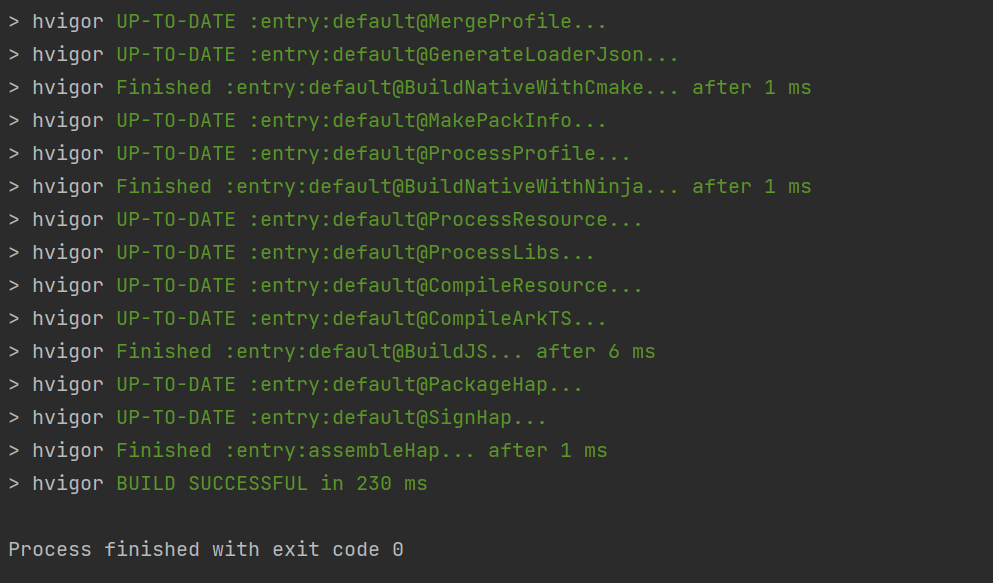
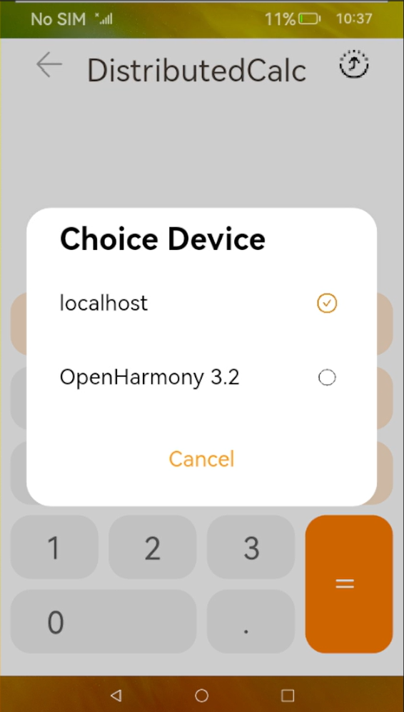
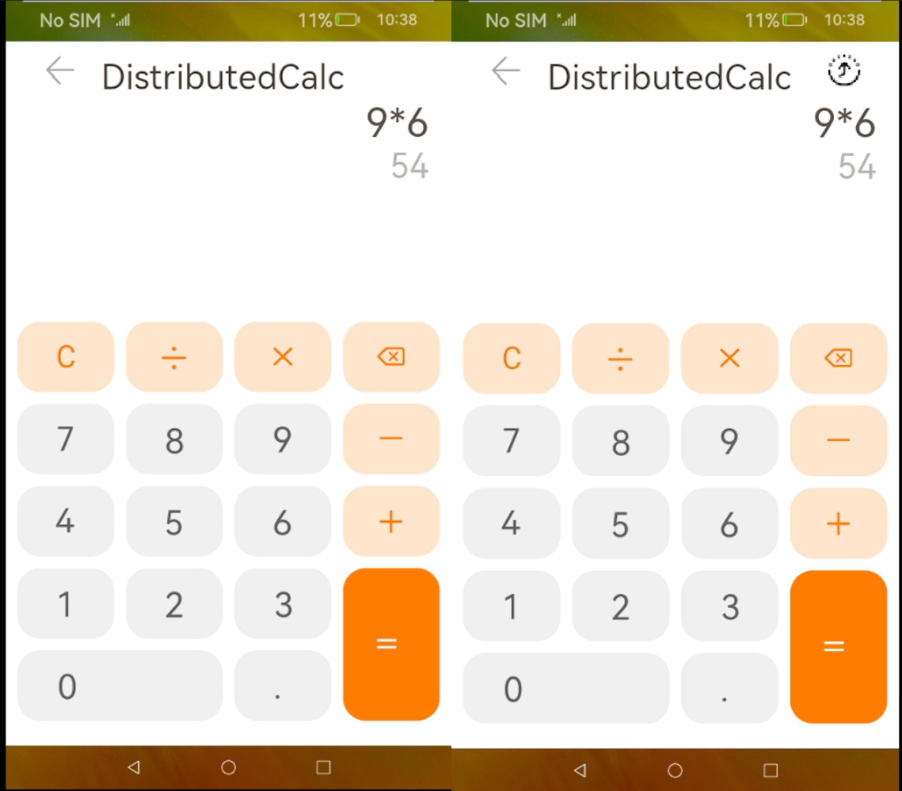

# Distributedcalc-demo

This is an app built using DevEco Studio.

## build and install
To download the code, run the following command:
```
git clone https://github.com/openharmony-research/distributedcalc-demo.git
```
Open the project in DevEco Studio. Then, build the hap. If you build successfully, you will see:


After a successful build, upload the `entry-default-signed.hap` to the server using command like `scp`.

Then start an OpenHarmony device using QEMU, connect to the device using the following command:
```
hdc tconn 192.168.137.2:5555
```

To install the app, use the following command:
```
hdc -t <ip> install xxx.hap
```
## use
To launch the demo app, use the command:
```
aa start -a MainAbility -b tutorial.samples.etsdistributedcalc
```

To experience the disrtibuted ability, you need to open 2 OpenHarmony device and pair them.


After pairing, type in the following command in QEMU to confirm permissions
```
uinput -T -c 350 740
```
and then
```
uinput -T -c 420 80
```
choose the device to connect
```
uinput -T -c 250 450
```


then you can type any number in the calc, and you will see the two device display same content.

## exit
If you want to exit, you need to change the pair option to `local` to exit the app on the second device
```
uinput -T -c 420 80
```
```
uinput -T -c 250 400
```
then the app on the second device will exit.
Now you can type 
```
aa force-stop tutorial.samples.etsdistributedcalc
```
to exit the app on the primary device.
